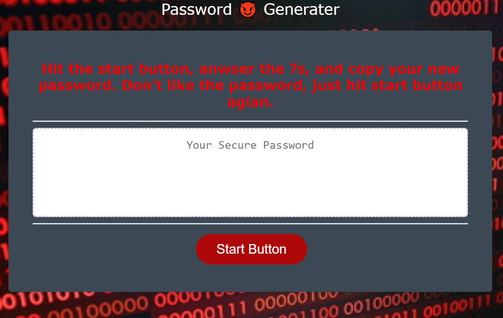

# Password Generator

## Table of Contents 

* [Usage](#usage)

* [License](#license)

* [Contributing](#contributing)

* [Questions](#questions)

## Description
    AS AN employee with access to sensitive data I want an application that generates a random password based on user-selected criteria. This app runs in the browser and feature dynamically updated HTML and CSS powered by your JavaScript code. It also feature a clean, responsive, and polished user interface, ensuring that it adapts to multiple screen sizes.

## Usage

Go to [https://travislovingood.github.io/Password-Generator/]

## License

This project is licensed under the Oh Yeah! License.
  
## Contributing

Travis Lovingood

## Questions

If you have any questions about the repo, open an issue or contact [https://github.com/TravisLovingood](undefined) directly at undefined.

